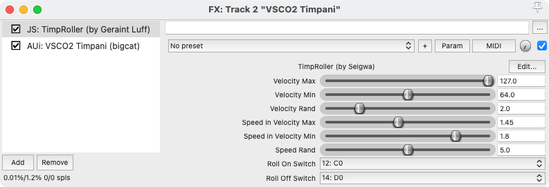

# sbt-reaper-jsfx
This repository contains my JSFX scripts for Reaper.

## MIDI Timpani roller

A JSFX script to emulate timpani rolls using VSCO2 Timpani or similar.

### Screenshot

### Features
+ Adjustable roll speed.
+ The roll speed remains constant regardless of tempo changes.
+ Perform crescendos and decrescendos.
+ Replicate crescendos and decrescendos through changes in velocity.

### Parameters
+ **Velocity Max**  The maximum velocity for adjusting the roll speed based on velocity changes. The roll speed will not change for velocities equal to or exceeding this value.
+ **Velocity Min**  The minimum velocity for adjusting the roll speed based on velocity changes. The roll speed will not change for velocities equal to or lower than this value.
+ **Velocity Rand**  The variability of velocity in the roll sound. Increasing this value will result in greater variations in velocity.
+ **Speed in Velocity Max**  Roll speed at the maximum velocity. A higher value will result in a finer roll.
+ **Speed in Velocity Min**  Roll speed at the minimum velocity. A higher value will result in a finer roll.
+ **Speed Rand**  Degree of variability in roll speed. A higher value will result in greater variations.
+ **Roll On Switch**  Key used for the roll-on keyswitch.
+ **Roll Off Switch**  Key used for the roll-off keyswitch.

### Usage

Please load a sound plug-in such as VSCO2 Timpani below this script. Although I haven't tested it, since it doesn't involve complex operations, it should work with any virtual instruments plug-in.

Once you activate the roll mode with a key switch, the script will continue rolling a note at the specified speed and velocity until a note-off signal is received when playing a sound. The roll speed is not affected by tempo changes, so there will be no sluggishness even during a ritardando. Please be aware that the roll will stop at the note-off timing of the key switch, regardless of whether a sound is being played.

The velocity of each note during the roll is controlled by the Expression (CC11). Therefore, if the sound plug-in has tonal changes based on velocity, lowering the Expression while rolling will result in a decrescendo accompanied by tonal changes, and raising the Expression will create a crescendo with tonal changes.

Furthermore, the initial volume of the roll is determined by the velocity of the note. By setting the Expression to a lower value and setting the note velocity higher, you can make an accent at the begining of the roll.

When performing a roll at high volume, the distance the mallet travels increases, resulting in a slightly rougher texture of the roll. To account for this, the script allows for variations in roll speed based on changes in volume. These variations will become larger as the range of **Speed in Velocity Max** and **Speed in Velocity Min** is increased.
